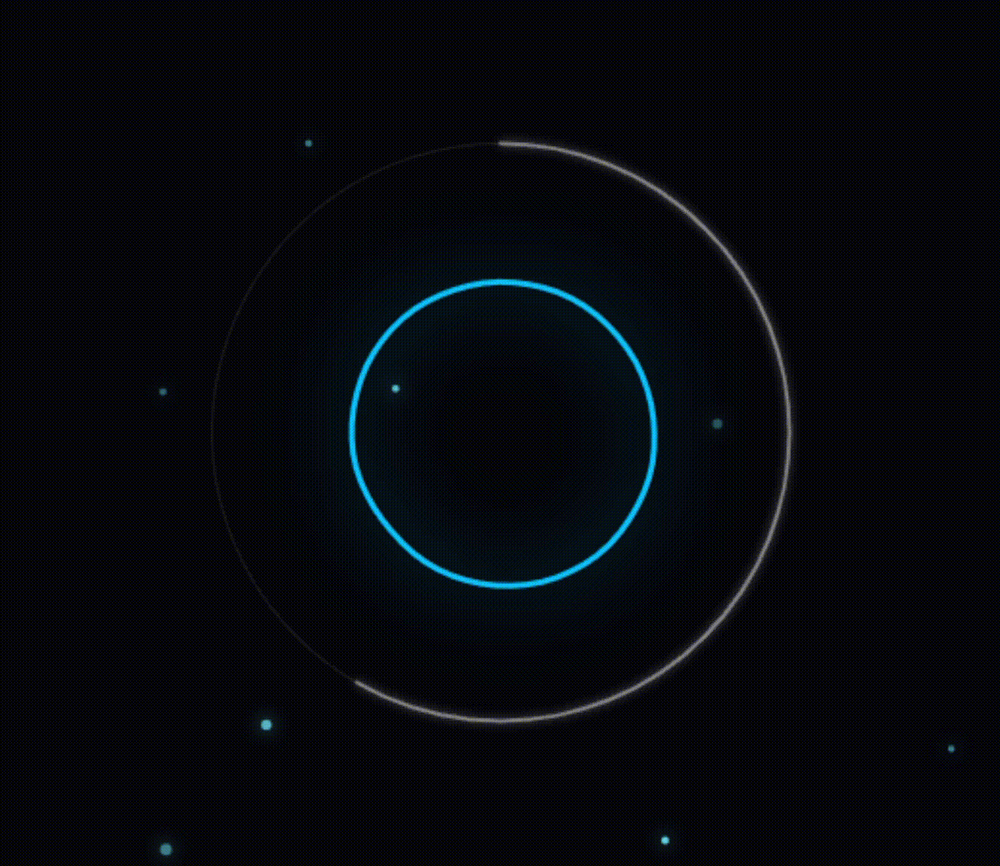
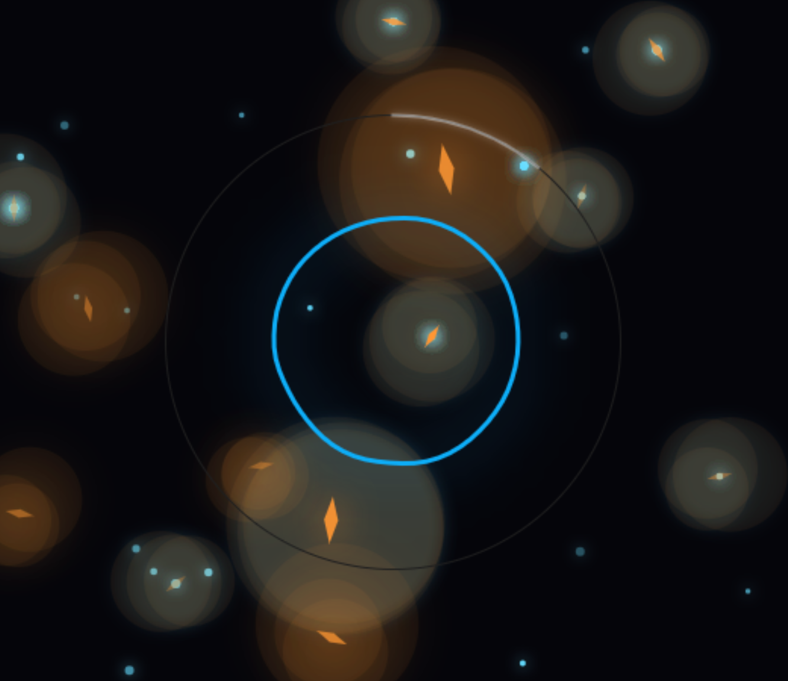

# ENTROPY MIRROR
### A Generative Art Installation on Sound and Time

<table>
  <tr>
    <td align="center" width="50%">
      
       
      <b>Zen Mode (Quiet)</b>
    </td>
    <td align="center" width="50%">
      
       
      <b>Chaos Mode (Loud)</b>
    </td>
  </tr>
</table>
 

[**Launch Live Experience**](https://yuntian-hou.github.io/Entropy-Mirror/)

 

---

## 🌌 Overview

**Entropy Mirror** is a digital organism that lives on sound.

Unlike traditional audio visualizers that just "dance" to music, this project treats sound as a physical force that distorts time and space. It listens to your environment, turning fleeting noise into a permanent visual history—a digital nebula of your day.

* **Input**: Your voice, music, or ambient room noise.
* **Output**: A unique, generative star map representing the "entropy" of that time period.

## ✨ Key Features

### 1. The Observer (The Core)
At the center lies a reactive neon entity. It breathes with silence and trembles with noise.
* **Quiet**: It remains a stable, flowing blue ring (Zen Mode).
* **Loud**: It fractures into a chaotic, red-gold distortion (Chaos Mode).

### 2. The Nebula Record (The History)
Every 5 seconds, the system takes a "sample" of the environment's entropy level and generates a star.
* **Quiet moments** create soft, cyan pearls.
* **Loud moments** create sharp, golden stars with a permanent nebula distortion effect behind them.

### 3. Gravitational Distortion
Loud sounds don't just change colors; they act like **black holes**. High-volume inputs trigger a gravitational shockwave, physically warping the position of every star in the background, simulating the impact of chaos on memory.

### 4. Auto-Archiving
The system acts as an ambient logger. Once the screen is filled with stars (approx. 12 minutes), it automatically saves a high-resolution snapshot of your "Sound Galaxy" and resets the canvas.

---

### 📸 Sample Output
*A snapshot of a generated "Sound Galaxy"*

---

## 🛠️ Tech Stack

* **Language**: JavaScript (ES6)
* **Library**: [p5.js](https://p5js.org/) (Creative Coding)
* **Audio**: p5.sound (Web Audio API)
* **Algorithms**: Perlin Noise, High-pass Filtering, Particle System

## 🚀 How to Run

1.  **Online**: Click the [Live Demo](https://yuntian-hou.github.io/Entropy-Mirror/) link above.
2.  **Local**:
    * Clone this repository.
    * Open `index.html` in any modern browser.
    * **Important**: Click anywhere on the screen to initialize the Audio Context (browser policy).

---

**Designed & Developed by Max Hou**
 
*2026*

